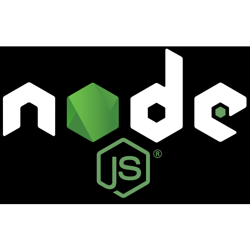

<h1 align="center">Hola, mi nombre es Andrea Jiménez</h1>
<h2 align="center">En vías de convertirme en desarrolladora FullsTack</h2>
<h3 align="center">Siempre aprendiendo!!!</h3>
<h3 align="center">Algunos lenguajes en los que he incursionado: </h3>

<h3 align="center">Bases de datos: </h3>

<h3 align="center">Entornos, frameworks y otras herramientas: </h3>

 

 

<h4>Mis hobbies:</h4>

Trabajo social y voluntariado

Literatura

Mosaiquismo

Alambrismo

